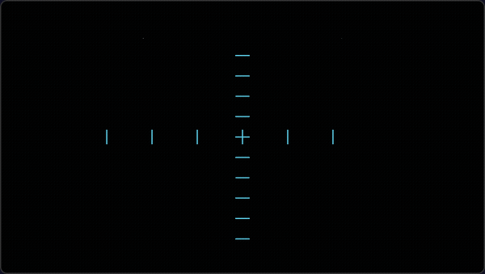

# manim-js

A TypeScript port of [Manim](https://github.com/3b1b/manim) (Mathematical Animation Engine) for the browser. Built on Three.js and WebGL, it brings Manim's declarative animation API to the web with no server-side rendering required.

## Features

- **Geometry** — Circle, Rectangle, Polygon, Arrow, Arc, Dot, Line, DashedLine, CubicBezier, Star, Brace, and more
- **Text & LaTeX** — Text, MathTex, Tex, Paragraph, MarkupText rendered via KaTeX
- **Graphing** — Axes, NumberLine, NumberPlane, FunctionGraph, ParametricFunction, VectorField, BarChart
- **3D** — Sphere, Cube, Cylinder, Torus, Surface3D, ThreeDAxes, Arrow3D with orbit controls
- **Animations** — FadeIn/Out, Create, Transform, Rotate, Scale, Shift, Write, GrowFromCenter, AnimationGroup, LaggedStart, Succession
- **Rate functions** — smooth, easeIn/Out, thereAndBack, rushInto, bounce, and composable utilities
- **Interaction** — Draggable, Hoverable, Clickable mobjects, PlaybackControls, OrbitControls
- **Export** — GIF and video export from animations
- **Framework integrations** — React and Vue component wrappers
- **Graphs & Tables** — Network graph visualization, Matrix, Table with typed variants

## Quick Start

```bash
git clone https://github.com/maloyan/manim-js.git
cd manim-js
npm install
npm run dev
```

## Usage

### Square to Circle

```typescript
import { Scene, Circle, Square, Create, Transform, FadeOut } from 'manim-js';

async function squareToCircle(scene: Scene) {
  const square = new Square({ sideLength: 3 });
  const circle = new Circle({ radius: 1.5 });

  await scene.play(new Create(square));
  await scene.play(new Transform(square, circle));
  await scene.play(new FadeOut(square));
}
```

<p align="center">
  
</p>

### Function Graphs

```typescript
import { Scene, Axes, FunctionGraph, MathTex, Create, FadeIn, WHITE } from 'manim-js';

async function graphDemo(scene: Scene) {
  const axes = new Axes({
    xRange: [-3, 3, 1],
    yRange: [-5, 5, 1],
    xLength: 8,
    yLength: 6,
    tips: true,
  });

  const graph = new FunctionGraph({
    func: (x) => x * x,
    xRange: [-2.2, 2.2],
    color: WHITE,
    axes,
  });

  const label = new MathTex({ latex: 'x^2', fontSize: 32 });
  label.shift([4.5, 2, 0]);

  await scene.play(new Create(axes), new Create(graph), new FadeIn(label));
}
```

<p align="center">
  
</p>

### LaTeX Equations

```typescript
import { Scene, MathTex, Write } from 'manim-js';

async function equationDemo(scene: Scene) {
  const equation = new MathTex({
    latex: 'd(p, q) = \\sqrt{\\sum_{i=1}^n (q_i - p_i)^2}',
    fontSize: 48,
  });
  await scene.play(new Write(equation));
}
```

<p align="center">
  
</p>

### Text Animations

```typescript
import { Scene, Text, Write, FadeIn, FadeOut, AnimationGroup, WHITE, RED, DOWN } from 'manim-js';

async function textDemo(scene: Scene) {
  const firstLine = new Text({ text: 'Create cool animations', fontSize: 48, color: WHITE });
  const secondLine = new Text({ text: 'using Manim', fontSize: 48, color: WHITE });
  const thirdLine = new Text({ text: 'Try it out yourself.', fontSize: 48, color: RED });

  secondLine.nextTo(firstLine, DOWN);

  await scene.play(new Write(firstLine), new Write(secondLine));
  await scene.play(new AnimationGroup([
    new FadeOut(firstLine),
    new FadeIn(thirdLine),
    new FadeOut(secondLine),
  ]));
}
```

<p align="center">
  
</p>

## Tools

### Python Manim to TypeScript Converter

```bash
node tools/py2ts.cjs input.py           # convert a Python Manim script
node tools/py2ts.cjs input.py -o out.ts # specify output file
node tools/py2ts.cjs --test             # run built-in test suite
```

Handles class/method mapping, kwargs conversion, lambda syntax, multi-line statements, and constructor arg wrapping.

## Project Structure

```
src/
├── core/           # Scene, Mobject, VMobject, VGroup, Camera, Renderer
├── animation/      # All animation types (creation, fading, movement, transform)
├── constants/      # Colors and direction constants
├── mobjects/
│   ├── geometry/   # 2D shapes (Circle, Line, Polygon, Arrow, etc.)
│   ├── graphing/   # Axes, NumberLine, FunctionGraph, VectorField
│   ├── text/       # Text, MathTex, KaTeX rendering
│   ├── three-d/    # 3D primitives and surfaces
│   ├── svg/        # SVG parsing, Brace
│   ├── graph/      # Network graph visualization
│   ├── matrix/     # Matrix display
│   └── table/      # Table display
├── interaction/    # Drag, hover, click, orbit controls
├── integrations/   # React and Vue wrappers
├── export/         # GIF and video export
├── rate-functions/ # Easing and timing functions
└── utils/          # Performance monitoring
tools/
└── py2ts.cjs       # Python Manim → TypeScript converter
```

## Tech Stack

- **TypeScript** with strict types
- **Three.js** for WebGL rendering
- **KaTeX** for LaTeX math rendering
- **Vite** for dev server and builds

## License

MIT
